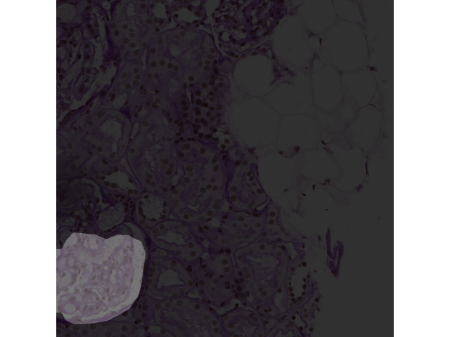

# MMDet 进阶作业
## 实验设备
GTX2070 Mobile

## 数据集
组织病理切片小鼠肾小球：https://zihao-openmmlab.obs.cn-east-3.myhuaweicloud.com/20230130-mmseg/dataset/Glomeruli-dataset.zip
## 模型指标
+------------+-------+-------+
|   Class    |  IoU  |  Acc  |
+------------+-------+-------+
| background | 99.04 | 99.91 |
|   crack    | 52.28 | 54.59 |
+------------+-------+-------+
## 模型下载地址
```
链接: https://pan.baidu.com/s/1CHsjp9z2LZWfIyrTqGsr5A 提取码: mmcv 复制这段内容后打开百度网盘手机App，操作更方便哦
```
## 示意图
