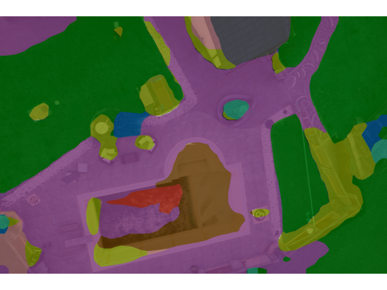

# MMDet 进阶作业
## 实验设备
GTX2070 Mobile
## 数据集
无人机航拍：https://www.kaggle.com/datasets/bulentsiyah/semantic-drone-dataset
## 模型指标
+-------------+-------+-------+
|    Class    |  IoU  |  Acc  |
+-------------+-------+-------+
|  unlabeled  |  0.0  |  0.0  |
|  paved-area | 72.87 | 94.24 |
|     dirt    | 22.22 | 29.71 |
|    grass    | 79.38 | 94.03 |
|    gravel   | 43.69 | 55.12 |
|    water    | 45.72 | 48.87 |
|    rocks    |  0.0  |  0.0  |
|     pool    | 47.24 | 51.76 |
|  vegetation | 36.73 | 54.88 |
|     roof    | 46.28 | 48.42 |
|     wall    |  8.34 | 11.53 |
|    window   |  0.0  |  0.0  |
|     door    |  0.0  |  0.0  |
|    fence    |  0.0  |  0.0  |
|  fence-pole |  0.0  |  0.0  |
|    person   | 20.37 | 34.16 |
|     dog     |  0.0  |  0.0  |
|     car     | 24.49 | 25.32 |
|   bicycle   |  0.0  |  0.0  |
|     tree    | 28.22 | 42.09 |
|  bald-tree  |  0.0  |  0.0  |
|  ar-marker  |  0.0  |  0.0  |
|   obstacle  | 17.22 | 36.64 |
| conflicting |  nan  |  nan  |
+-------------+-------+-------+
## 模型下载地址
```
链接: https://pan.baidu.com/s/1q3hZd4dWPiUHGN1hBXqbMw 提取码: mmcv 复制这段内容后打开百度网盘手机App，操作更方便哦
```
## 示意图



没时间了，要不应该还可以更加细化，应该跟显卡不够所以用差模型也有一定关系，用个好点的模型就Out of Memory